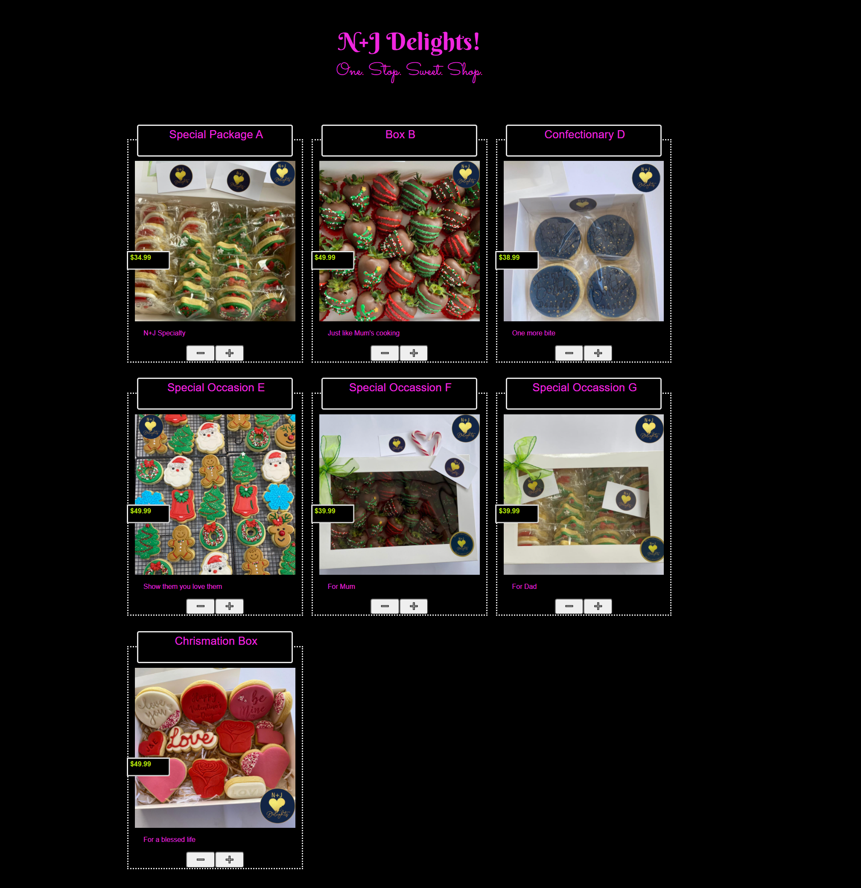

# NJ Delights

## Description

One Stop Sweet Shop

<!-- ### Usage

When you open the page, you will be presented with several timeslots for a typical working day. You can type directly into the textbox for each of the timeblocks and save it. This persists in your localstorage of the browser but does not transfer to different browsers or across different devices. As you go through the day, the colour code of the timeblocks will change to reflect the time of the day. There is a colour legend placed at the right of the page. The colour code for the timeblocks resets at midnight. You can also choose to reset all tasks for the whole day, supposedly when you start a new day, by clicking the reset button at the bottom of the colour legend. -->

<!-- ## Link to the Deployed Application

[TaskIt Planner](https://forester93.github.io/Task-It/)

## Link to the Github Repository

[TaskIt Planner Github Repo](https://github.com/Forester93/Task-It)

## Screenshot of the Application

 -->

## Contact me

| Name          | Email                    | Phone Numer         |
| ------------- | ------------------------ | ------------------- |
| Mark Forester | markforester93@gmail.com | +61 (0) 404-831-362 |

## Commits for this Application

### First Commit

• Created the markdown file.

### Second Commit

• Added basic jQuery to the page.  
• Added basic styling to the page.  
• Added basic products bank to the page.

### Third Commit

• Aligned items for initial view.
